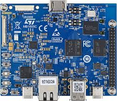

# STM32MP2 Discovery Kit ISP Cloud Control Demo

This demo provides instructions on configuring and using the Avnet /IOTCONNECT cloud platform to remotely control and monitor the Image Signal Processor (ISP) on the **STM32MP257F Discovery Kit**. It enables users to remotely stream video, control ISP settings, and view real-time telemetry data.

---
## Index

- [STM32MP2 Discovery Kit ISP Cloud Control Demo](#stm32mp2-discovery-kit-isp-cloud-control-demo)
  - [Hardware Requirements](#hardware-requirements)
  - [Software Requirements](#software-requirements)
    - [Pre-installation Steps](#pre-installation-steps)
    - [/IOTCONNECT SDK Setup](#iotconnect-sdk-setup)
  - [Running the ISP Cloud Control Demo](#running-the-isp-cloud-control-demo)
    - [Step-by-Step Guide](#step-by-step-guide)
  - [Available Commands from /IOTCONNECT Cloud](#available-commands-from-iotconnect-cloud)
  - [Telemetry Data Sent to /IOTCONNECT](#telemetry-data-sent-to-iotconnect)
  - [Example Command Sequence for Testing](#example-command-sequence-for-testing)
  - [Relevant Images and Documentation](#relevant-images-and-documentation)

--- 

## Hardware Requirements

- **STM32MP257F Discovery Kit**  

    

- **Camera module compatible with STM32MP257F** (recommended IMX335)

    

- **5V External Power Supply** (Required due to high current draw with camera and ISP)

- **Ethernet cable** (for network connectivity)

---

## Software Requirements

### Pre-installation Steps

1. **Setup X-LINUX-ISP Starter Package**  

Follow these instructions to set up the STM32MP257F Discovery Kit with the X-LINUX-ISP Starter Package:

- Visit the official STMicroelectronics guide:
  - [X-LINUX-ISP Starter Package](https://wiki.st.com/stm32mpu/wiki/X-LINUX-ISP_Starter_package)

- **Populate and boot the STM32MP257F Discovery Kit** following these instructions:
  - [Populate and Boot Instructions](https://wiki.st.com/stm32mpu/wiki/Getting_started/STM32MP2_boards/STM32MP257x-EV1/Let%27s_start/Populate_the_target_and_boot_the_image)

  or build your custom Yocto image using the meta-layer:
  - [meta-st-x-linux-isp](https://github.com/STMicroelectronics/meta-st-x-linux-isp)

- Complete steps **5 to 7** on the official page:
  - [Configure and test ISP](https://wiki.st.com/stm32mpu/wiki/X-LINUX-ISP_Starter_package)

---

### /IOTCONNECT  SDK Setup

Install /IOTCONNECT  Python SDK Lite using the Quickstart guide:

- **Quickstart Guide:**  
  [/IOTCONNECT  Python Lite SDK](https://github.com/avnet-iotconnect/iotc-python-lite-sdk/blob/main/QUICKSTART.md)

```bash
sudo apt-get update
sudo apt-get install python3-pip -y
python3 -m pip install iotconnect-sdk-lite
```

---

## Running the ISP Cloud Control Demo

### Step-by-Step Guide

1. **Clone the demo repository** to your STM32MP2 board (optional):

```bash
git clone https://github.com/avnet-iotconnect/iotc-python-lite-sdk-demos.git
cd iotc-python-lite-sdk-demos/stm32mp2-isp-control
```

Alternatively, copy the provided script directly onto the board.

2. **Modify device credentials** (`iotcDeviceConfig.json`, `device-cert.pem`, and `device-pkey.pem`) from your IoTConnect account and copy them to the device directory.

3. **Run the ISP cloud control script**:

```bash
python3 isp-cloud-control.py
```

---
## Available Commands from IoTConnect Cloud

| Command                | Parameters                          | Example                                 | Description                               |
|------------------------|-------------------------------------|-----------------------------------------|-------------------------------------------|
| `start-stream`         | None                                | `start-stream`                          | Starts video streaming                    |
| `stop-stream`          | None                                | `stop-stream`                           | Stops video streaming                     |
| `set-exposure`         | Integer (microseconds)              | `set-exposure 33000`                    | Sets sensor exposure                      |
| `set-contrast`         | 9 integers (space-separated)        | `set-contrast 256 256 128 128 128 128 128 128 128` | Sets luminance contrast                   |
| `set-gain`             | Float or integer (sensor gain in dB)| `set-gain 4`                            | Sets sensor gain                          |
| `set-awb`              | String (`enable` or `disable`)      | `set-awb disable`                       | Enables/Disables auto white balance (AWB) |
| `set-black-level`      | 3 integers for RGB values           | `set-black-level 16 16 16`              | Sets black level correction               |
| `set-isp-gain`         | 3 floats (R, G, B gains, 0.1–2.45)  | `set-isp-gain 1.2 1.0 1.4`              | Adjusts ISP gain (scaled internally to Q0.31 fixed-point format) |
| `set-aec`              | String (`enable` or `disable`)      | `set-aec disable`                       | Enables/Disables Auto Exposure Control    |
| `set-aec-compensation` | Float (-2 to +2 EV)                 | `set-aec-compensation 0.5`              | Sets exposure compensation                |
| `set-demosaicing`      | String (`enable` or `disable`)      | `set-demosaicing enable`                | Enables/Disables ISP demosaicing          |
| `get-isp-settings`     | None                                | `get-isp-settings`                      | Returns current ISP settings as telemetry |


## Telemetry Data Sent to /IOTCONNECT
| Telemetry Field        | Data Type         | Example Value          | Description                             |
|------------------------|-------------------|------------------------|-----------------------------------------|
| `sdk_version`          | String            | `"1.1.0"`              | SDK version                             |
| `exposure`             | Integer           | `33274`                | Sensor exposure time (µs)               |
| `sensor_gain`          | Float             | `19.82`                | Sensor gain (in dB)                     |
| `isp_gain`             | Object (floats)   | `{ "R": 1.4, "G": 1.0, "B": 2.75 }` | ISP gains (scaled from Q0.31 internally)|
| `black_level`          | Object (integers) | `{ "R": 12, "G": 12, "B": 12 }`   | Black level RGB corrections             |
| `aec_enabled`          | Boolean           | `true`                 | Auto Exposure Control status            |
| `aec_exposure_compensation`| Float         | `0.5`                  | AEC exposure compensation (EV)          |
| `awb_enabled`          | Boolean           | `false`                | Auto White Balance status               |
| `demosaicing_enabled`  | Boolean           | `true`                 | ISP Demosaicing status                  |
| `awb_profile`          | String            | `"IMX335-A"`           | Current AWB profile                     |
| `awb_temperature`      | Integer           | `2856`                 | AWB color temperature (K)               |
| `avg_red`              | Integer           | `55`                   | Average red channel value               |
| `avg_green`            | Integer           | `52`                   | Average green channel value             |
| `avg_blue`             | Integer           | `55`                   | Average blue channel value              |
| `avg_luminance`        | Integer           | `53`                   | Average luminance value                 |
| `luminance`            | Object (integers) | `{ "lum_0":100, ..., "lum_256":100 }` | Luminance distribution                  |
| `histogram`            | Object (integers) | `{ "bin_0":0, ..., "bin_11":0 }`      | Histogram data                          |

--- 

## Example Command Sequence for Testing

1. Disable AWB and AEC:
```bash
set-awb disable
set-aec disable
```

2. Set ISP Gains:
```bash
set-isp-gain 1.2 1.0 1.4
```

3. Adjust Exposure and Gain:
```bash
set-exposure 33000
set-gain 4
```

4. Adjust AEC Compensation:
```bash
set-aec-compensation 0.5
```

5. Retrieve current ISP settings:
```bash
get-isp-settings
```

---

## Notes
- Ensure numeric parameters (e.g., ISP gain) are sent in proper floating-point format (e.g., `1.2` instead of `1/2`).
- Incorrectly formatted values will be handled gracefully with error messages.

---
## Relevant Images and Documentation

- **STM32MP257 Discovery Kit Official Page:**  
  [STM32MP257 Discovery Kit](https://www.st.com/en/evaluation-tools/stm32mp257f-dk2.html)

- **/IOTCONNECT  Documentation and SDKs:**  
  [/IOTCONNECT  GitHub](https://github.com/avnet-iotconnect)

- **STMicroelectronics ISP Wiki:**  
  [STMicroelectronics ISP Documentation](https://wiki.st.com/stm32mpu/wiki/X-LINUX-ISP)

- **STM32MP257 ISP Demo in action:**  
  
